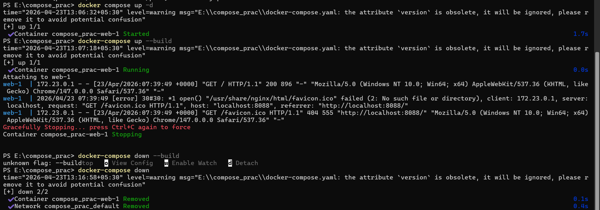
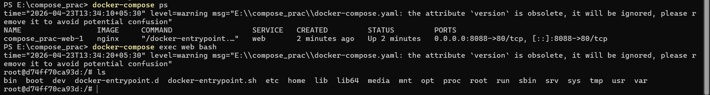

docker-compose up -d
---> used to run a container on existing image 

docker-compose up --build
---> if any changes made it will rebuild the container

docker-compose stop
---> used to stop the container

docker-compose start
---> used to start the container

docker-compose down
---> stops the container as well as removes the container

docker-compose exec <service> bash
---> opens the bash of that particular service in the terminal

docker-compose up --scale web=3
--->Creates 3 containers of service web 
--->example:
            web_1
            web_2
            web_3

